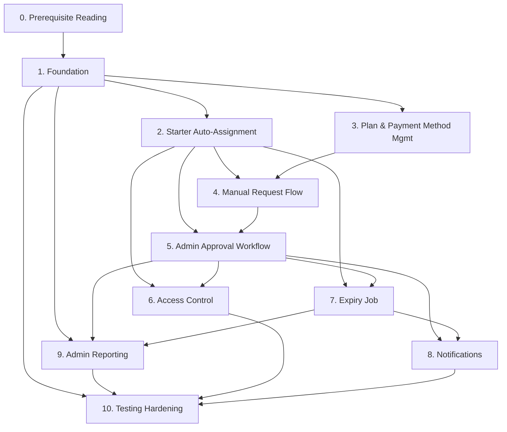

# Agrigax Backend — Development Roadmap

**Authoritative source**: [`docs/01-subscription-requirements-v2.md`](./01-subscription-requirements-v2.md), §13 ("Suggested Rollout Phases"). This document expands those ten phases into full implementation units. It does not add, remove, or reorder phases beyond what §13 already specifies — it adds the operational detail (tasks, DB/backend work, testing, acceptance criteria, dependencies) needed to execute each one.

Guides a developer from an empty database to a production-ready subscription backend.

---

## Phase 0 — Prerequisite Reading

**Goal**: Every developer touching this system reads the requirements doc and the schema doc before writing code.

**Scope**: No code. Read [`01-subscription-requirements-v2.md`](./01-subscription-requirements-v2.md) in full, then [`04-database-schema.md`](./04-database-schema.md) and [`02-api-specification.md`](./02-api-specification.md).

**Acceptance Criteria**: Developer can explain, without re-reading: why `features` and `limits` are separate JSON columns (§4.1), why the default plan's `end_date` is always `null` (§12.1), and why activation is a single atomic transaction (§4.6).

**Dependencies**: None.

---

## Phase 1 — Foundation

**Goal**: The five new tables exist; the old `payments`/`wallet` modules are gone.

**Scope**: Migrations only — no business logic yet (§13 phase 1).

**Tasks**
1. Write migrations for `subscription_plans`, `payment_methods`, `subscription_requests`, `vendor_subscriptions`, `subscription_request_logs`, in the dependency order given in [`04-database-schema.md §7`](./04-database-schema.md#7-migration-order).
2. Remove `payments` module: routes, controller, service, repository, validation, migration (drop table or mark deprecated per team's migration-reversal policy).
3. Remove `wallet` module: same layers.
4. Update any route registration / module index files that reference the removed modules.

**Database Work**
- 5 new migrations (see schema doc for exact columns/types/constraints per table).
- 1–2 migrations to drop `payments`/`wallet` tables (or a documented decision to leave them and simply stop routing to them, if destructive drops are deferred to a later cleanup).

**Backend Work**
- Delete `payments` and `wallet` route/controller/service/repository files.
- No new endpoints yet.

**Testing Requirements**
- Migrations run cleanly up and down on a fresh database.
- App boots with `payments`/`wallet` routes fully removed (no 500s from dangling imports).

**Acceptance Criteria**
- `knex migrate:latest` (or equivalent) produces all 5 tables with correct columns per §4.
- No route in the app resolves to a `payments` or `wallet` controller.

**Dependencies**: Phase 0.

---

## Phase 2 — Starter Auto-Assignment

**Goal**: Every new vendor is on the Starter plan the instant registration completes, with zero manual step (§3, §5.1).

**Scope**: One hook inside the existing `auth` registration flow.

**Tasks**
1. Seed at least one `subscription_plans` row with `is_default_vendor_plan = true` (needed before this phase can be tested — see [`04-database-schema.md §8`](./04-database-schema.md#8-seeding-order)).
2. After a vendor-role user row is created in `auth`/registration, look up the plan flagged `is_default_vendor_plan = true`.
3. Insert a `vendor_subscriptions` row: `status=active`, `start_date=now`, `end_date=null`, `created_from_request_id=null` (§5.1).
4. Do **not** create a `subscription_requests` or `subscription_request_logs` row for this event (§5.1.3).

**Database Work**: None beyond the seed row from step 1.

**Backend Work**: One insert added to the registration service, inside the same request lifecycle as user creation (does not need its own transaction wrapper unless registration itself already uses one — but must not silently fail without surfacing an error, since a vendor with no subscription row breaks every downstream gate in Phase 6).

**Testing Requirements**
- Registering a vendor creates exactly one `vendor_subscriptions` row, `status=active`, `end_date=null`.
- Registering a customer creates **no** `vendor_subscriptions` row (§1, §8).
- If no plan has `is_default_vendor_plan = true`, registration must fail loudly (misconfiguration), not silently skip subscription assignment.

**Acceptance Criteria**: A freshly registered vendor can immediately be queried via `GET /subscriptions/current` and receives Starter with `endDate: null`.

**Dependencies**: Phase 1 (tables must exist); requires at least one seeded default plan.

---

## Phase 3 — Plan & Payment Method Management

**Goal**: Admins can fully manage the plan catalog and payment instructions without a deploy (§9 "Plans", §9 "Configuration").

**Scope**: Admin CRUD endpoints for `subscription_plans` and `payment_methods`, per [`02-api-specification.md §7–§8`](./02-api-specification.md#7-admin--plan-management-9-plans).

**Tasks**
1. `POST/GET/PATCH/DELETE /admin/subscriptions/plans` — including the single-default-plan invariant (setting `isDefaultVendorPlan: true` atomically unsets it elsewhere) and the delete-only-if-unreferenced rule (§9).
2. `POST/GET/PATCH /admin/payment-methods` — no delete route, per §9's narrower scope for this resource.
3. Vendor-facing read endpoints: `GET /subscriptions/plans`, `GET /subscriptions/plans/:id`, `GET /subscriptions/payment-methods` — filtered to `is_active = true`.

**Database Work**: None new — this phase is pure CRUD over Phase 1's tables.

**Backend Work**: Controllers, services, repositories, and Joi validation schemas for both resources, following the existing `routes → controllers → services → repositories` layering (§1 stack).

**Testing Requirements**
- Creating a second plan with `isDefaultVendorPlan: true` correctly unsets the flag on the previous default.
- Deleting a plan referenced by any `vendor_subscriptions` or `subscription_requests` row is rejected (409).
- Disabling a plan (`isActive: false`) removes it from the vendor-facing list but leaves existing subscriptions referencing it valid.
- Vendor-facing plan/payment-method lists never include inactive rows.

**Acceptance Criteria**: An admin can create a paid plan and a payment method through the API alone, with no code change, and a vendor immediately sees both via the vendor-facing endpoints.

**Dependencies**: Phase 1.

---

## Phase 4 — Manual Request Flow

**Goal**: A vendor can submit proof of an off-platform payment and track its status (§6 steps 1–5).

**Scope**: Vendor-facing subscription-request endpoints, per [`02-api-specification.md §5`](./02-api-specification.md#5-subscription-requests--vendor-facing).

**Tasks**
1. `POST /subscriptions/requests` — validates `planId` (active plan), `paymentMethodId` (existing method), `amount`, `transactionReference`; accepts optional `receiptUrl`, `notes`.
2. Receipt upload handling — `receipt_url` stored as a storage-provider-agnostic string (§4.3); the actual upload mechanism (S3/Supabase/Cloudinary/etc.) is an infrastructure choice, not specified by the requirements doc.
3. `GET /subscriptions/requests`, `GET /subscriptions/requests/:id` — scoped strictly to the authenticated vendor's own requests.

**Database Work**: None new.

**Backend Work**: Controller/service/repository/validation for `subscription_requests`, write path only (status transitions to `approved`/`rejected` belong to Phase 5).

**Testing Requirements**
- A request is created with `status=pending` and does not touch `vendor_subscriptions` at all.
- A vendor cannot view or act on another vendor's request (403).
- Missing/invalid `planId` or `paymentMethodId` is rejected with 400/404, not silently accepted.

**Acceptance Criteria**: A vendor can go from "view plans" → "view payment instructions" → "submit a request" → "see it listed as pending" entirely through the API.

**Note on open decisions**: §12.7 (multiple pending requests) is unresolved — this phase should not hard-code an assumption either way beyond what's needed to ship; flag the gap rather than guessing (see [`02-api-specification.md §5`](./02-api-specification.md)).

**Dependencies**: Phases 1, 3 (needs plans and payment methods to reference).

---

## Phase 5 — Admin Approval Workflow

**Goal**: An admin can approve or reject a request, with approval atomically activating the new subscription (§4.6, §5, §6 steps 6–7).

**Scope**: The single highest-risk phase in the whole roadmap — this is where the atomicity guarantees in §4.6 must be implemented correctly.

**Tasks**
1. `GET /admin/subscription-requests`, `GET /admin/subscription-requests/:id` (with embedded `subscription_request_logs`).
2. `POST /admin/subscription-requests/:id/approve` — one atomic transaction:
   a. Deactivate the vendor's current `active` `vendor_subscriptions` row **first** (§4.6 rule 3).
   b. Insert new `vendor_subscriptions` row (`start_date=now`, `end_date=now+plan.duration_days`, `status=active`, `created_from_request_id=request.id`).
   c. Update the request: `status=approved`, `verified_by`, `verified_at`.
   d. Insert `subscription_request_logs` row (`action=approved`).
   e. Send "subscription approved" notification (wired fully in Phase 8; a stub/no-op is acceptable here if Phase 8 hasn't landed yet, but the call site must exist).
3. `POST /admin/subscription-requests/:id/reject` — one transaction: `status=rejected`, log row (`action=rejected`, `comment=reason`), notify vendor. No `vendor_subscriptions` writes.

**Database Work**: None new — this phase is entirely business logic over Phase 1's tables.

**Backend Work**: The transactional activation logic is the core deliverable. Use the database layer's transaction primitive (Knex `transaction()`) to wrap steps 2a–2d as a single unit that either fully commits or fully rolls back (§4.6 rule 2).

**Testing Requirements** (see [`05-testing-strategy.md`](./05-testing-strategy.md) for full detail)
- Approving a request when the vendor has an existing active subscription deactivates the old row before the new row exists — never both `active` simultaneously.
- A simulated failure partway through activation (e.g. forced error before the log insert) rolls back **all** writes — the prior subscription remains active, the request remains `pending`.
- Approving a request that is not `pending` is rejected (409), not silently re-processed.
- Every approve/reject produces exactly one `subscription_request_logs` row — never zero, never more than one.
- Rejecting a request never mutates `vendor_subscriptions`.

**Acceptance Criteria**: Under concurrent/adversarial testing, a vendor never ends up with two `active` `vendor_subscriptions` rows, and a failed activation never leaves a partial state.

**Dependencies**: Phases 1, 2 (a vendor must already have a Starter row to deactivate), 4 (needs pending requests to act on).

---

## Phase 6 — Access Control

**Goal**: Plan `features`/`limits` actually gate vendor actions (§8).

**Scope**: The `requireActiveSubscription` middleware and its application to existing `listings`/`bookings` routes, per [`02-api-specification.md §13`](./02-api-specification.md#13-existing-endpoints-gated-by-requireactivesubscription-8).

**Tasks**
1. Build `requireActiveSubscription(requiredCheck?)` middleware: confirms an `active`, non-expired `vendor_subscriptions` row exists for the authenticated vendor, and optionally evaluates a `features`/`limits` check (e.g. `limits.maxFeaturedListings > 0`, `features.analytics === true`).
2. Apply to: create listing, publish/unpublish listing, accept a booking, promote/feature a listing, and any other `features`-gated action (§8).
3. Return `403 SUBSCRIPTION_REQUIRED` on failure, without altering the existing success-path response shape of any gated endpoint.

**Database Work**: None new — reads `vendor_subscriptions` joined to `subscription_plans`.

**Backend Work**: One reusable Express middleware; wired into existing route files without modifying their controllers/services.

**Testing Requirements**
- A vendor on a plan with `maxFeaturedListings=0` is blocked from promoting a listing; a vendor on a plan with `maxFeaturedListings>0` is allowed.
- A vendor whose only subscription has expired (and the expiry job hasn't run yet, if that's architecturally possible) is still correctly evaluated as "not active" by `end_date`, independent of `status`.
- Customer-facing routes are never affected by this middleware (§8).

**Acceptance Criteria**: Every action listed in §8 is gated; no customer route is gated; error responses follow the standard envelope from [`02-api-specification.md §1`](./02-api-specification.md#1-conventions).

**Dependencies**: Phases 1, 2, 5 (there must be a way to reach both Starter and paid `active` states to test both branches).

---

## Phase 7 — Expiry Job

**Goal**: Paid subscriptions expire on schedule and fall back to permanent Starter automatically (§7, §12.1, §12.2).

**Scope**: New scheduled-job infrastructure — the app has none today (§7, opening line).

**Tasks**
1. Stand up a job runner (cron / background worker — infrastructure choice, not specified by requirements doc).
2. Expiry check (hourly or daily, per §7): find all `vendor_subscriptions` where `status=active AND end_date<now` (this query naturally excludes the permanent-Starter row, since its `end_date` is always `null` — §7 point 1).
3. For each: mark `status=expired`, then **in the same transaction** create a new `vendor_subscriptions` row for the default plan (`status=active`, `start_date=now`, `end_date=null`, `created_from_request_id=null`) — §7 point 3, §12.2.
4. Separate scheduled check (not the same query as expiry) for the 7-day and 3-day pre-expiry windows, feeding Phase 8's notifications (§7 point 4, §10).

**Database Work**: None new.

**Backend Work**: Job scheduling infrastructure + the transactional expire-and-fallback logic, reusing the same atomicity discipline as Phase 5's activation transaction.

**Testing Requirements**
- A paid subscription past `end_date` is marked `expired` and a new Starter row (`end_date=null`) is created in the same job run, atomically.
- The permanent-Starter row is never selected by the expiry query (`end_date=null` is never `< now`).
- The pre-expiry check at 7 and 3 days fires once per threshold, not repeatedly on every job tick.
- A vendor is never left with zero `active` rows after this job runs.

**Acceptance Criteria**: Fast-forwarding a paid subscription's `end_date` into the past and running the job once leaves the vendor on `active` Starter, with the old row `expired`, and no manual intervention.

**Dependencies**: Phases 1, 2, 5.

---

## Phase 8 — Notifications

**Goal**: All five required events actually create notification rows (§10).

**Scope**: Wiring `createNotification` calls into the flows built in Phases 5 and 7 — the `notifications` module itself (list/mark-read) already exists and is unchanged.

**Tasks**
1. Subscription request approved → call at Phase 5's approve transaction.
2. Subscription request rejected → call at Phase 5's reject transaction.
3. Subscription expires in 7 days / 3 days → call at Phase 7's pre-expiry check.
4. Subscription expired → call at Phase 7's expiry transaction.

**Database Work**: None — uses the existing `notifications` table.

**Backend Work**: Five call sites, no new endpoints (§10; see [`02-api-specification.md §12`](./02-api-specification.md#12-notifications-10)). Delivery channel is in-app only for v2 (§10, closing note) — no email/SMS integration.

**Testing Requirements**
- Each of the five events produces exactly one notification row per occurrence, addressed to the correct vendor.
- No event fires twice for the same underlying occurrence (e.g. the 7-day warning doesn't refire on every subsequent job tick before the 3-day threshold).

**Acceptance Criteria**: Triggering each of Phases 5/7's flows in a test environment produces a visible row in `GET /notifications` for the affected vendor.

**Dependencies**: Phases 5, 7.

---

## Phase 9 — Admin Reporting

**Goal**: Admins have full visibility into requests, subscriptions, and revenue (§9 "Subscriptions", "Reporting").

**Scope**: Read-only aggregate/list endpoints, per [`02-api-specification.md §10–§11`](./02-api-specification.md#10-admin--vendor-subscriptions-9-subscriptions).

**Tasks**
1. `GET /admin/vendor-subscriptions` with `status`/`expiringWithinDays` filters, covering history/active/expired/upcoming in one endpoint (§9).
2. `GET /admin/reports/revenue` (total/monthly/yearly, from **approved** `subscription_requests` only — §9 closing note).
3. `GET /admin/reports/vendors` (active/Starter/paid counts).
4. `GET /admin/reports/requests` (pending/approved/rejected, date-range filterable).
5. `GET /admin/reports/expirations` (expired count + upcoming, 7/3-day windows).

**Database Work**: Confirm the indexes recommended in [`04-database-schema.md`](./04-database-schema.md) are in place — these queries are aggregate/filter-heavy.

**Backend Work**: Read-only controllers/services; no writes.

**Testing Requirements**
- Revenue figures only ever sum `approved` requests, never `pending`/`rejected`/`expired`.
- Vendor counts (`starterVendors` + `paidVendors`) always sum to `activeVendors`, since every active vendor is on exactly one of the two categories.
- Date-range filters on request reports correctly bound `created_at`/`verified_at` as applicable.

**Acceptance Criteria**: An admin can answer, via API alone: "how much revenue this month," "how many vendors are on Starter vs. paid," "what's pending review," "who expires in the next 7 days."

**Dependencies**: Phases 1, 5, 7 (needs real data flowing through approval and expiry to report on).

---

## Phase 10 — Testing Hardening

**Goal**: The subscription module has a working, comprehensive test suite — independent of the app-wide suite, which is currently broken (§13 phase 10, §1 "tests broken").

**Scope**: See [`05-testing-strategy.md`](./05-testing-strategy.md) for the full breakdown by layer and module.

**Tasks**
1. Fix or bypass whatever is broken in the existing app-wide harness enough to run subscription-module tests in isolation, if a shared harness is required.
2. Starter auto-assignment (Phase 2).
3. Request submission (Phase 4).
4. Approval activation logic — the deactivate-old/create-new atomicity guarantee and the "never more than one active subscription" invariant (Phase 5).
5. Audit log creation on every approve/reject (Phase 5).
6. Expiry job correctness, including the permanent Starter-fallback creation and its `end_date=null` invariant (Phase 7).
7. Middleware gating (Phase 6).

**Database Work**: A seedable, resettable test database/fixture set (at minimum: one default plan, one paid plan, one payment method — matching [`04-database-schema.md §8`](./04-database-schema.md#8-seeding-order)).

**Backend Work**: None beyond what earlier phases already built — this phase is test authorship.

**Testing Requirements**: This phase *is* the testing requirement — see [`05-testing-strategy.md`](./05-testing-strategy.md).

**Acceptance Criteria**: All items in the Tasks list above have passing automated tests, runnable in CI independent of the rest of the app-wide suite's current state.

**Dependencies**: Phases 1–9 (tests the behavior each of those phases built).

---

## Phase Dependency Graph

---

## Cross-References

- Every endpoint referenced above: [`02-api-specification.md`](./02-api-specification.md).
- Every table/column referenced above: [`04-database-schema.md`](./04-database-schema.md).
- Full test breakdown per phase: [`05-testing-strategy.md`](./05-testing-strategy.md).
- Deploying the result of this roadmap: [`06-deployment-guide.md`](./06-deployment-guide.md).
