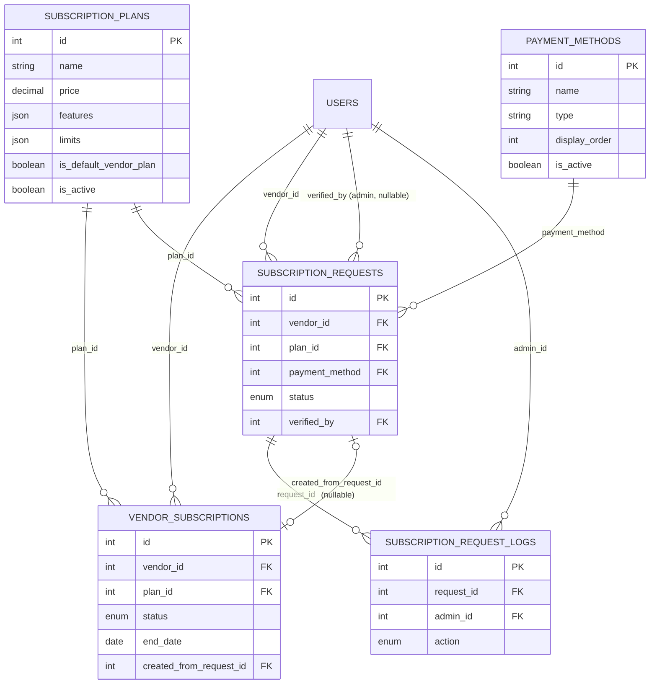

# Agrigax Backend — Database Schema Documentation

**Authoritative source**: [`docs/01-subscription-requirements-v2.md`](./01-subscription-requirements-v2.md), §4 ("Database Model"). This document restates that schema in reference form — purpose, columns, constraints, relationships, indexes, and example records — for implementers building migrations and repositories. No new tables, columns, or constraints are introduced beyond what §4 specifies. No SQL is included; see [`03-development-roadmap.md`](./03-development-roadmap.md) for migration sequencing.

---

## 1. Entity Relationship Overview



**Reading this diagram**: `users` is the existing table from the `auth`/`users` module (unchanged by this document) — it is the parent for every `vendor_id`, `verified_by`, and `admin_id` foreign key below. All five subscription tables are new (§4, opening paragraph): they replace the retired `payments` and `wallet` tables entirely, not extend them (§2).

---

## 2. `subscription_plans`

**Source**: §4.1

**Purpose**: The admin-managed catalog of plans a vendor can be on. Every plan is fully configurable — nothing about tiers, pricing, or capability names is hardcoded in application logic (§3). Exactly one row is flagged as the plan auto-assigned at vendor registration.

### Columns

| Column | Type | Nullable | Default | Notes |
|---|---|---|---|---|
| `id` | integer (PK) | no | auto | |
| `name` | string | no | — | e.g. "Starter", "Business" — admin-defined |
| `description` | text | no | — | shown to vendors when choosing a plan |
| `price` | decimal | no | — | `0` for Starter; admin-set for others |
| `currency` | string | no | — | |
| `duration_days` | integer | no | — | length of one paid period; not applied to the default plan (§12.1) |
| `features` | JSON | no | `{}` | boolean capability flags, e.g. `analytics`, `prioritySupport`, `verifiedBadge` |
| `limits` | JSON | no | `{}` | numeric quotas, e.g. `maxListings`, `maxFeaturedListings`, `maxImagesPerListing`, `maxCategories`, `maxBookingsPerMonth`, `maxPromotions`, `maxBranches`, `storageLimitMb` |
| `is_default_vendor_plan` | boolean | no | `false` | exactly one row system-wide must be `true` |
| `is_active` | boolean | no | `true` | inactive plans are hidden from vendor selection; historical references remain valid |
| `created_at` | timestamp | no | now | |
| `updated_at` | timestamp | no | now | |

### Constraints
- `id`: primary key.
- `name`: recommended `NOT NULL`; uniqueness is an implementation choice not specified by §4.1 (the source doc identifies the default plan by `is_default_vendor_plan`, not by name, precisely so name collisions are not architecturally significant — §3).
- **Application-enforced invariant**: at most one row may have `is_default_vendor_plan = true` at any time (§4.1). Not a column-level constraint — enforced procedurally, the same way the "one active subscription per vendor" invariant is (§4.6).

### Foreign Keys
None — this is a root table.

### Relationships
- One `subscription_plans` row → many `vendor_subscriptions` rows (`plan_id`).
- One `subscription_plans` row → many `subscription_requests` rows (`plan_id`).

### Recommended Indexes
- Index on `is_active` — every vendor-facing plan list query filters on it (§3 endpoint `GET /subscriptions/plans`).
- Index on `is_default_vendor_plan` — looked up on every vendor registration (§5.1) and every expiry-job run (§7).

### Example Record
```json
{
  "id": 1,
  "name": "Starter",
  "description": "Free plan for every new vendor",
  "price": "0.00",
  "currency": "TZS",
  "duration_days": 30,
  "features": { "analytics": false, "prioritySupport": false, "verifiedBadge": false },
  "limits": { "maxListings": 5, "maxFeaturedListings": 0, "maxImagesPerListing": 5 },
  "is_default_vendor_plan": true,
  "is_active": true,
  "created_at": "2026-01-01T00:00:00Z",
  "updated_at": "2026-01-01T00:00:00Z"
}
```

---

## 3. `payment_methods`

**Source**: §4.2

**Purpose**: Admin-managed catalog of off-platform payment instructions (mobile money, bank transfer, etc.) shown to vendors during upgrade. Editable without a deploy.

### Columns

| Column | Type | Nullable | Default | Notes |
|---|---|---|---|---|
| `id` | integer (PK) | no | auto | |
| `name` | string | no | — | e.g. "M-Pesa", "Bank Transfer" |
| `type` | string | no | — | `mobile_money \| bank_account \| other` — informs which fields below are relevant |
| `account_name` | string | yes | `null` | e.g. bank account holder name |
| `account_number` | string | yes | `null` | e.g. bank account number |
| `phone_number` | string | yes | `null` | e.g. mobile money number |
| `instructions` | text | yes | `null` | free-text guidance alongside structured fields |
| `display_order` | integer | no | — | controls vendor-facing display order |
| `is_active` | boolean | no | `true` | inactive methods are hidden from vendor selection |
| `created_at` | timestamp | no | now | |
| `updated_at` | timestamp | no | now | |

### Constraints
- `id`: primary key.
- `type`, `display_order`, `is_active`: `NOT NULL`.

### Foreign Keys
None — root table.

### Relationships
- One `payment_methods` row → many `subscription_requests` rows (`payment_method`). Referenced by ID/FK, never free text (§4.2, §4.3).

### Recommended Indexes
- Index on `is_active` — filtered on every vendor-facing lookup (§4 endpoint `GET /subscriptions/payment-methods`).
- Index on `display_order` — every vendor-facing list is ordered by it.

### Example Record
```json
{
  "id": 1,
  "name": "M-Pesa",
  "type": "mobile_money",
  "account_name": null,
  "account_number": null,
  "phone_number": "0700000000",
  "instructions": "Pay and keep the confirmation SMS.",
  "display_order": 1,
  "is_active": true,
  "created_at": "2026-01-01T00:00:00Z",
  "updated_at": "2026-01-01T00:00:00Z"
}
```

---

## 4. `subscription_requests`

**Source**: §4.3

**Purpose**: A vendor's manual payment submission when requesting an upgrade — a request/approval record, distinct from the actual entitlement (`vendor_subscriptions`).

### Columns

| Column | Type | Nullable | Default | Notes |
|---|---|---|---|---|
| `id` | integer (PK) | no | auto | |
| `vendor_id` | integer (FK → users.id) | no | — | |
| `plan_id` | integer (FK → subscription_plans.id) | no | — | plan being requested |
| `payment_method` | integer (FK → payment_methods.id) | no | — | which admin-configured method the vendor used |
| `amount` | decimal | no | — | amount the vendor claims to have paid |
| `transaction_reference` | string | no | — | vendor-supplied reference/transaction ID |
| `receipt_url` | string | yes | `null` | storage-provider-agnostic reference to proof of payment |
| `notes` | text | yes | `null` | optional vendor note |
| `status` | enum | no | `pending` | `pending \| approved \| rejected \| expired` |
| `verified_by` | integer (FK → users.id) | yes | `null` | admin who actioned the request |
| `verified_at` | timestamp | yes | `null` | |
| `created_at` | timestamp | no | now | |
| `updated_at` | timestamp | no | now | |

### Constraints
- `id`: primary key.
- `vendor_id`, `plan_id`, `payment_method`, `amount`, `transaction_reference`, `status`: `NOT NULL`.
- `status = expired` covers requests left `pending` too long without admin action — exact threshold is an **open decision** (§12.3), not yet specified.

### Foreign Keys
- `vendor_id` → `users.id`
- `plan_id` → `subscription_plans.id`
- `payment_method` → `payment_methods.id`
- `verified_by` → `users.id` (nullable — only set once an admin acts)

### Relationships
- One `subscription_requests` row → many `subscription_request_logs` rows (`request_id`) — every approve/reject action on this request is logged (§4.5).
- One `subscription_requests` row → at most one `vendor_subscriptions` row, via that row's `created_from_request_id` (only when the request is approved).

### Recommended Indexes
- Index on `vendor_id` — vendor's own request history (§6 step 5).
- Index on `status` — admin filtering by status (§9).
- Composite index on `(status, created_at)` — supports the pending-request-expiry job once §12.3 is resolved.

### Example Record
```json
{
  "id": 771,
  "vendor_id": 501,
  "plan_id": 2,
  "payment_method": 1,
  "amount": "25000.00",
  "transaction_reference": "MPESA-QK123XYZ",
  "receipt_url": "https://storage.example.com/receipts/abc123.jpg",
  "notes": "Paid via M-Pesa on 2026-07-13",
  "status": "approved",
  "verified_by": 12,
  "verified_at": "2026-07-13T10:00:00Z",
  "created_at": "2026-07-13T09:05:00Z",
  "updated_at": "2026-07-13T10:00:00Z"
}
```

---

## 5. `vendor_subscriptions`

**Source**: §4.4

**Purpose**: The actual, historical entitlement record. **Immutable once created** — a new row is always inserted on activation; existing rows are only ever updated to flip `status`. This preserves complete subscription history per vendor.

### Columns

| Column | Type | Nullable | Default | Notes |
|---|---|---|---|---|
| `id` | integer (PK) | no | auto | |
| `vendor_id` | integer (FK → users.id) | no | — | |
| `plan_id` | integer (FK → subscription_plans.id) | no | — | |
| `status` | enum | no | — | `pending \| active \| expired \| cancelled` — `pending` is reserved for future use (future-dated start, scheduled plan change, migration); no v2 flow produces it |
| `start_date` | date/timestamp | no | — | set at activation time |
| `end_date` | date/timestamp | yes | `null` | `start_date + plan.duration_days` for paid plans; **always `null` for the row on the default (`is_default_vendor_plan`) plan** — Starter is permanent (§12.1) |
| `created_from_request_id` | integer (FK → subscription_requests.id) | yes | `null` | `null` for both the registration-time Starter row and every Starter-fallback row created by the expiry job — neither has a request behind it |
| `created_at` | timestamp | no | now | |
| `updated_at` | timestamp | no | now | |

### Constraints
- `id`: primary key.
- `vendor_id`, `plan_id`, `status`, `start_date`: `NOT NULL`.
- **Application-enforced invariant** (not a simple DB constraint — MySQL/Knex cannot straightforwardly express "at most one active row per vendor" as a filtered unique constraint): a vendor may never have more than one `status = active` row at a time (§4.6 rule 1). Maintained procedurally: deactivate-then-create, inside one transaction, always in that order (§4.6 rules 2–3).

### Foreign Keys
- `vendor_id` → `users.id`
- `plan_id` → `subscription_plans.id`
- `created_from_request_id` → `subscription_requests.id` (nullable)

### Relationships
- Many `vendor_subscriptions` rows per vendor over time (full history, never deleted or overwritten).
- At most one `subscription_requests` row per `vendor_subscriptions` row, via `created_from_request_id`.

### Recommended Indexes
- Index on `vendor_id` — every "current plan" and "vendor history" lookup filters on it (§4.4, §6, §10).
- Composite index on `(vendor_id, status)` — the "exactly one active row" invariant check and the `GET /subscriptions/current` lookup both filter on both columns together.
- Index on `(status, end_date)` — the expiry job's core query is `status = active AND end_date < now` (§7).

### Example Record
```json
{
  "id": 9002,
  "vendor_id": 501,
  "plan_id": 2,
  "status": "active",
  "start_date": "2026-07-13T10:00:00Z",
  "end_date": "2026-08-12T10:00:00Z",
  "created_from_request_id": 771,
  "created_at": "2026-07-13T10:00:00Z",
  "updated_at": "2026-07-13T10:00:00Z"
}
```

---

## 6. `subscription_request_logs`

**Source**: §4.5

**Purpose**: Immutable audit trail for every action taken on a `subscription_requests` row — accountability independent of the mutable `status`/`verified_by`/`verified_at` fields on the request itself.

### Columns

| Column | Type | Nullable | Default | Notes |
|---|---|---|---|---|
| `id` | integer (PK) | no | auto | |
| `request_id` | integer (FK → subscription_requests.id) | no | — | |
| `admin_id` | integer (FK → users.id) | no | — | admin who performed the action |
| `action` | enum | no | — | `approved \| rejected` (extendable later, e.g. `reassigned`, `commented`) |
| `comment` | text | yes | `null` | admin's note; doubles as the rejection reason when `action = rejected` |
| `created_at` | timestamp | no | now | |

### Constraints
- `id`: primary key.
- `request_id`, `admin_id`, `action`: `NOT NULL`.
- **No `updated_at`** — this table is append-only by design; rows are never edited (§4.5).
- Every approve/reject action **must** produce exactly one row here, generated automatically as part of the same transaction as the status change — never an optional or manual admin step (§4.5, §4.6).

### Foreign Keys
- `request_id` → `subscription_requests.id`
- `admin_id` → `users.id`

### Relationships
- Many `subscription_request_logs` rows per `subscription_requests` row (one per action taken on it).

### Recommended Indexes
- Index on `request_id` — every audit-trail view is scoped to one request (§9, §4 endpoint `GET /admin/subscription-requests/:id`).

### Example Record
```json
{
  "id": 1,
  "request_id": 771,
  "admin_id": 12,
  "action": "approved",
  "comment": null,
  "created_at": "2026-07-13T10:00:00Z"
}
```

---

## 7. Migration Order

Dictated by foreign-key dependency direction (§4, §13 phase 1):

1. `subscription_plans` — no dependencies.
2. `payment_methods` — no dependencies.
3. `subscription_requests` — depends on `users` (existing), `subscription_plans`, `payment_methods`.
4. `vendor_subscriptions` — depends on `users` (existing), `subscription_plans`, `subscription_requests` (for `created_from_request_id`).
5. `subscription_request_logs` — depends on `subscription_requests`, `users`.

Retiring the old modules (`payments`, `wallet` migrations, routes, controllers, services, repositories, validations) is part of the same foundation phase but has no ordering dependency on the five migrations above (§2, §13 phase 1).

---

## 8. Seeding Order

For a fresh environment to reach a usable state:

1. **`subscription_plans`** — seed at least one plan with `is_default_vendor_plan = true` (conventionally "Starter", `price = 0`, `end_date` semantics = permanent per §12.1) before any vendor can register, since registration depends on this row existing (§5.1 step 1). Seed one or more paid plans (e.g. "Business") for upgrade testing.
2. **`payment_methods`** — seed at least one active method so the upgrade flow (§6) is testable end-to-end.
3. **Users (vendors)** — via the existing `auth` seeder/registration flow. Each vendor seeded this way automatically receives a `vendor_subscriptions` row per §5.1 — no separate seed step needed for that row.
4. **`subscription_requests`** / **`vendor_subscriptions`** (paid) / **`subscription_request_logs`** — optional, only needed to seed realistic historical/demo data (e.g. an approved upgrade, a rejected request) for admin-dashboard development and testing.

Seeding order mirrors migration order because the same FK dependencies apply: a plan and a payment method must exist before any request referencing them can be seeded, and a request must exist before a `vendor_subscriptions` row can reference it via `created_from_request_id`.

---

## 9. Cross-References

- Business rules behind every constraint above: [`09-business-rules.md`](./09-business-rules.md).
- How these tables are exposed over REST: [`02-api-specification.md`](./02-api-specification.md).
- Migration build order as part of the phased rollout: [`03-development-roadmap.md`](./03-development-roadmap.md).
