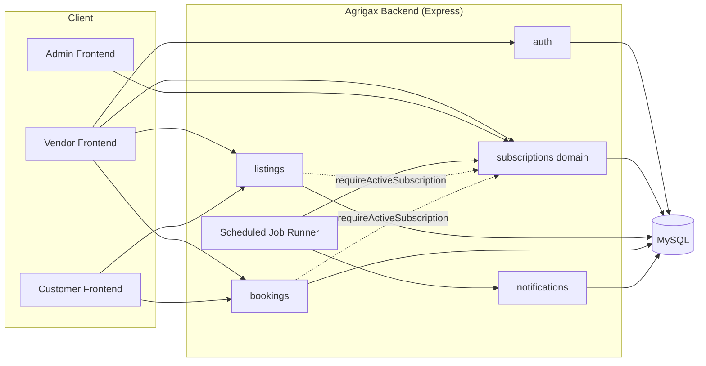
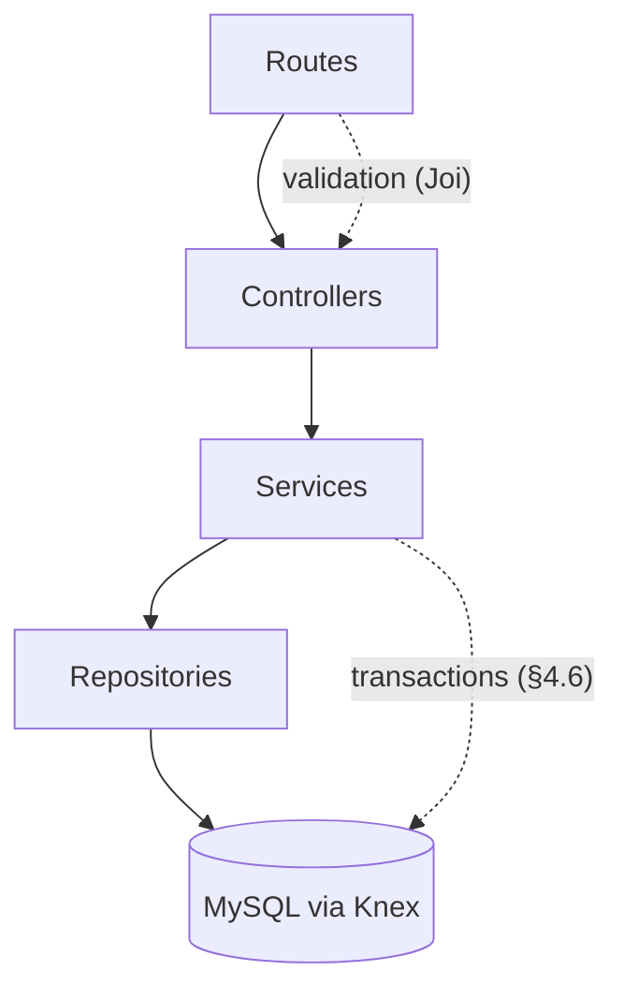
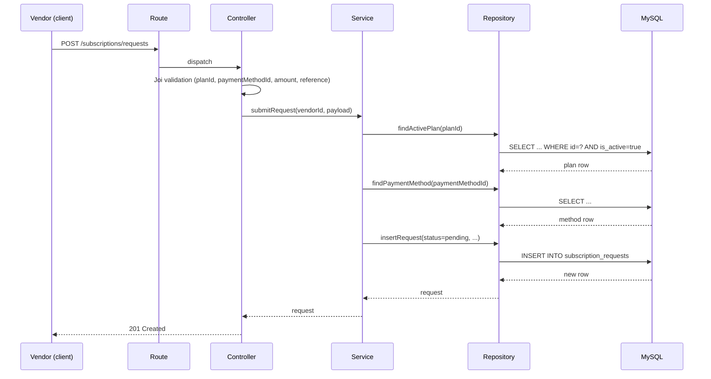
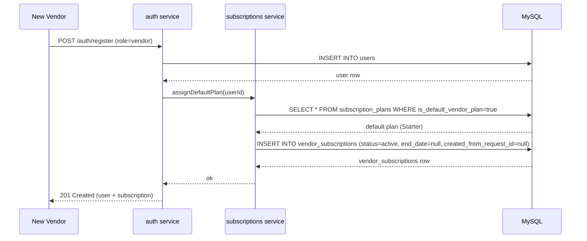
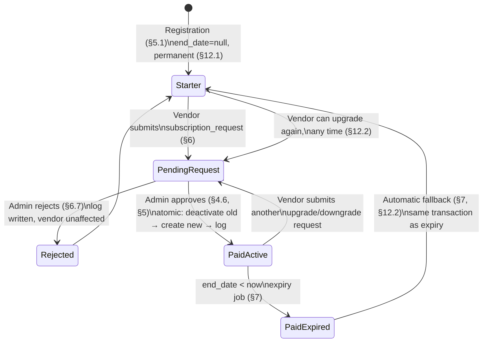
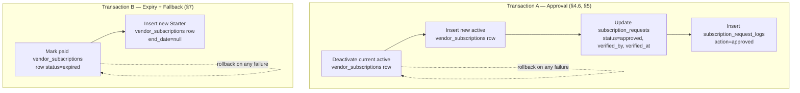
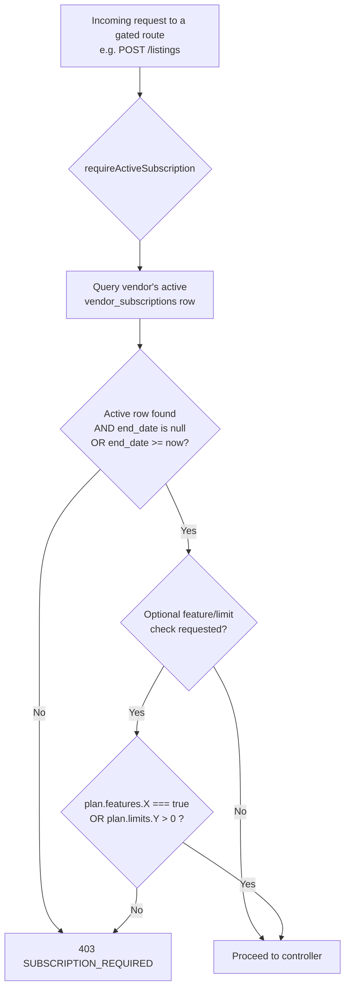
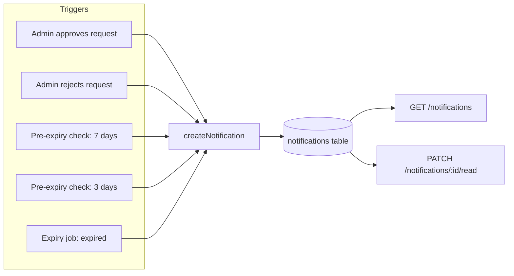
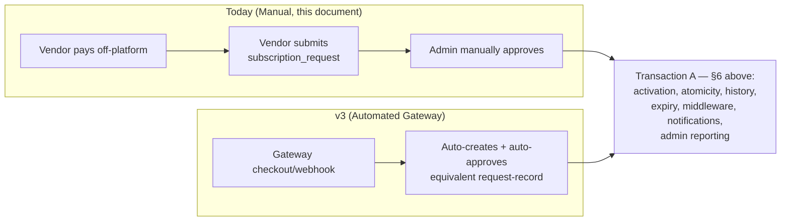

# Agrigax Backend — Architecture Overview

**Authoritative source**: [`docs/01-subscription-requirements-v2.md`](./01-subscription-requirements-v2.md). This document visualizes the flows and structures already specified there. No new architectural decisions are introduced — diagrams and prose only explain how the pieces in §4–§8 fit together at runtime. No implementation code.

---

## 1. System Architecture

Agrigax Backend is a monolithic Node.js/Express API over MySQL (§1). The subscription system is one bounded domain within it, deliberately isolated from the payment domain (§11):



**Customers never touch the subscription domain** (§1, §8) — the dotted lines show the only coupling: existing modules calling into the subscription domain's middleware to check gating, not the reverse.

---

## 2. Layered Architecture

Every module, including the five new subscription tables' modules, follows the existing layering (§1):



| Layer | Responsibility in the subscription domain |
|---|---|
| Routes | Bind HTTP method + path to a controller; attach `requireActiveSubscription` where relevant (listings/bookings only, §8) |
| Controllers | Joi validation, auth/role checks, shape the HTTP response |
| Services | All business rules from §3–§9: the single-default-plan invariant, the activation transaction (§4.6), expiry-and-fallback (§7) |
| Repositories | Knex queries against the five subscription tables (§4) |

Business rules live in the **service** layer exclusively — repositories are dumb data access, controllers are dumb HTTP translation. This is what makes the atomicity guarantees in §4.6 testable in isolation (see [`05-testing-strategy.md §3`](./05-testing-strategy.md#3-service-tests)).

---

## 3. Request Flow — Vendor Submits a Subscription Request



This flow never touches `vendor_subscriptions` (§4.3) — submission is purely a `subscription_requests` write.

---

## 4. Authentication Flow — Vendor Registration with Starter Auto-Assignment



Per §5.1: no `subscription_requests` or `subscription_request_logs` row is created here — this is system-assigned, not vendor-submitted.

---

## 5. Subscription Flow — Full Lifecycle

This is the diagram from §5 of the requirements document, restated visually:



**Key invariant carried through every state above**: at most one `vendor_subscriptions` row is `active` per vendor at any instant (§4.6 rule 1); a vendor is never in a state with zero active rows (§7 point 3).

---

## 6. Transaction Boundaries (§4.6)

The two places where multiple writes must succeed or fail together:



**Rule, restated from §4.6 and §7**: order matters — deactivate/expire the old row strictly before creating the new one, and both writes commit or roll back as a single unit. Never a moment with two `active` rows, never a moment with zero.

A third, simpler transaction boundary is registration-time Starter assignment (§5.1) — a single insert, not a deactivate-then-create pair, since there is no prior row to deactivate.

---

## 7. Middleware Flow — `requireActiveSubscription` (§8)



Applied only to the vendor actions enumerated in §8 (create listing, publish/unpublish, accept booking, promote/feature listing, other `features`-gated actions). Never applied to any customer-facing route.

---

## 8. Scheduled Jobs (§7)

The only polling process in the system — everything else is event-triggered (registration, admin approval):

```mermaid
flowchart TD
    Cron[Scheduler: hourly or daily] --> ExpiryCheck[Expiry Check\nstatus=active AND end_date < now]
    ExpiryCheck --> Found{Any rows found?}
    Found -->|No| Idle[No-op]
    Found -->|Yes| PerVendor[For each: Transaction B\n(§6 above) — expire + Starter fallback]
    PerVendor --> Notify1[Notify: subscription expired]

    Cron --> PreExpiryCheck["Pre-expiry Check\n(separate query, §7 point 4)"]
    PreExpiryCheck --> Day7{end_date within 7 days?}
    Day7 -->|Yes, not yet notified| Notify7[Notify: expires in 7 days]
    PreExpiryCheck --> Day3{end_date within 3 days?}
    Day3 -->|Yes, not yet notified| Notify3[Notify: expires in 3 days]
```

Note per §7: the pre-expiry check is explicitly a **second**, separate scheduled check against `end_date` — not something detected only at the moment of expiry.

---

## 9. Notification Flow (§10)



Per §10: delivery is in-app only for v2 — `createNotification` exists today but is called by nothing; this document's five triggers are what finally wire it up. No email/SMS provider exists yet.

---

## 10. Future Compatibility — Where a Gateway Would Plug In (§11)



Per §11: everything downstream of "a request is approved" already represents the final target architecture. Only the request *creation* step (manual submission vs. gateway webhook) changes in a future version.

---

## 11. Cross-References

- Every table referenced in these diagrams: [`04-database-schema.md`](./04-database-schema.md).
- Every endpoint referenced in these flows: [`02-api-specification.md`](./02-api-specification.md).
- Build order for the pieces shown here: [`03-development-roadmap.md`](./03-development-roadmap.md).
- Test coverage for each transaction boundary and flow: [`05-testing-strategy.md`](./05-testing-strategy.md).
